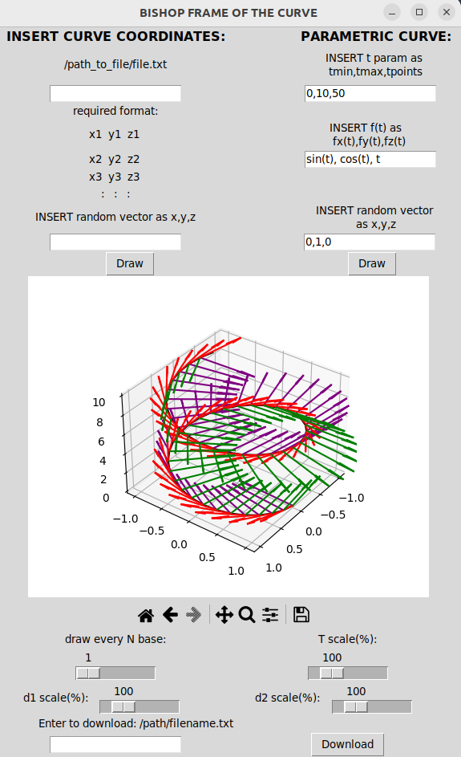

# Bishop frame of the curve

## Introduciton
 Most common frame of the curve describe Frenet-Seret equatons, which can be problematic when it comes to simulating curve dynamics. In points when a curve changes its curvature, the equaitons diverge. Fortunately, there is more than one way to frame a curve. One of them is Bishop frame, which is defined trough the concept of parallel transport. This simple code was written after [article](https://www.jstor.org/stable/2319846) and for a given curve constructs Bishop frame.

Everything can be written in Python, due to the low computational complexity, but out of the curiosity, I have written computational part in C++. Code was compiled with Cmake into shared library and linked with simple Python GUI.

## How to run?
Clone this repository and inside repository run Python file run.py. If you intend to change C++ code, than you need to build from source (you need Cmake or some other compiler which produces .so (shared file)). With terminal navigate inside repository and run
* sudo rm -r build
* mkdir build
* cmake ..
* cmake --build .
   

   
## GUI: 

  
 There are two ways to insert a curve coordinates, one is trough a .txt file, which requires certain format provided on the window. Second one is by constructing parametric curve. Because a Bishop frame is unique only to the "director" (vector perpendicular to the tangent vector) at first point, it is necessary to insert vector, which is not parallel to tangent vector (random vector) and with cross product we get first director. All  the base vectors are unit size, but they can be rescaled with pointers T,d1,d2. It is also possible to set the number of base triads. To download curve points and all local base triads insert file name.Regardless of number of local bases shown in plot, the same number of local bases as number of points will be in downloaded file. Format of downloaded data is given in file. 

   

